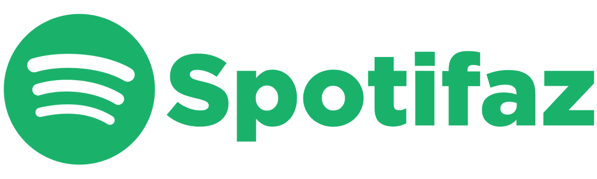
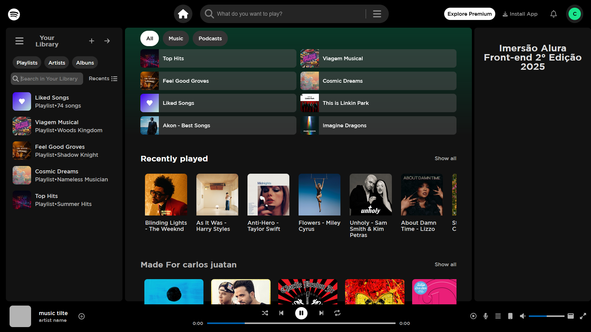
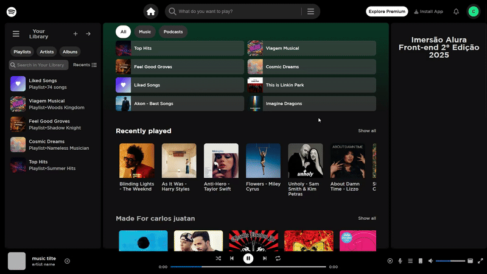

# SpotiFaz - A Spotify Clone (Educational Project)


This is a Spotify interface clone project developed during a front-end immersion event by Alura. The main intention of this project was to study and practice React technologies, exploring component creation, state management, and the construction of dynamic and responsive user interfaces.

## Visual Showcase

Below are some key views of the SpotiFaz application's main features and interfaces:

### Homepage

_(A view of the main page with the simulated list of songs and albums.)_

### Navigation

_(GIF showing the navigation between different parts of the application.)_

### Search for Music, Artists, Albums, and Playlists

_(GIF illustrating the search functionality for songs, artists, albums, and playlists.)_


## Technologies Used

- **Front-end:**
    - React
    - HTML5
    - CSS3
    - JavaScript (ES6+)
    - Vite (as a build tool and development environment)
- **Back-end (Simulated):**
    - Node.js
    - json-server (to emulate the API)

## Services Used

- **GitHub:** Used for code versioning, collaboration, and hosting the project repository.
- **json-server:** Used to simulate a REST API for development purposes. It provides a quick and easy way to mock backend endpoints without needing a full-fledged server.

## How to Run the Project

1.  **Clone the repository:**
    ```bash
    git clone https://github.com/Carlos-Juatan/spotifaz-react
    ```

2.  **Navigate to the project folder:**
    ```bash
    cd spotifaz-react
    ```

3.  **Install dependencies:**
    With npm:
    ```bash
    npm install
    ```

4.  **Run the Vite development server:**
    ```bash
    npm run dev
    ```

5.  **Install json-server globally (if not already installed):** With npm:
    ```bash
    npm install -g json-server
    ```

6.  **Start the json-server (in another terminal):**
    ```bash
    json-server --watch api-data/data.json --port 3001
    ```

7.  **Open the project in your browser:**
    Vite usually starts the project at `http://localhost:5173/` or another available port. Check the output in your terminal for the correct address.

Now, the Spotify clone (SpotiFaz) should be running in your browser, consuming the simulated data from `json-server`.

## Main Features

* **Browse Simulated Music:** Users can navigate through a simulated library of songs and albums.
* **Play/Pause Functionality:** Basic controls to play and pause the currently selected track.
* **Track Information Display:** Shows the title and artist of the playing song.
* **Simple Layout:** A clean and intuitive user interface inspired by Spotify's design.
* **Responsive Design:** The layout adapts to different screen sizes (desktop and mobile).
* **Data Fetched from Simulated Backend:** Utilizes `json-server` to load and display mock music data.
* **Simulated Search Functionality:** Allows users to search for songs, albums, and artists within the simulated library.
* **Basic Playlist Creation and Management:** Enables users to create new playlists and add/remove songs (functionality may be limited in this educational clone).

## Versioning

1.0.0.0

## Author

This "SpotiFaz" project was developed by Carlos Juatan as an educational project during Alura's front-end immersion event.

You can find more of my projects and contributions on my GitHub profile: https://github.com/Carlos-Juatan/

Feel free to explore the code and reach out if you have any questions or suggestions!

## License

This project is licensed under the MIT License. See the [MIT-License](https://github.com/Carlos-Juatan/spotifaz-react/blob/main/LICENSE) file for more information regarding the terms and conditions under which this software is licensed.